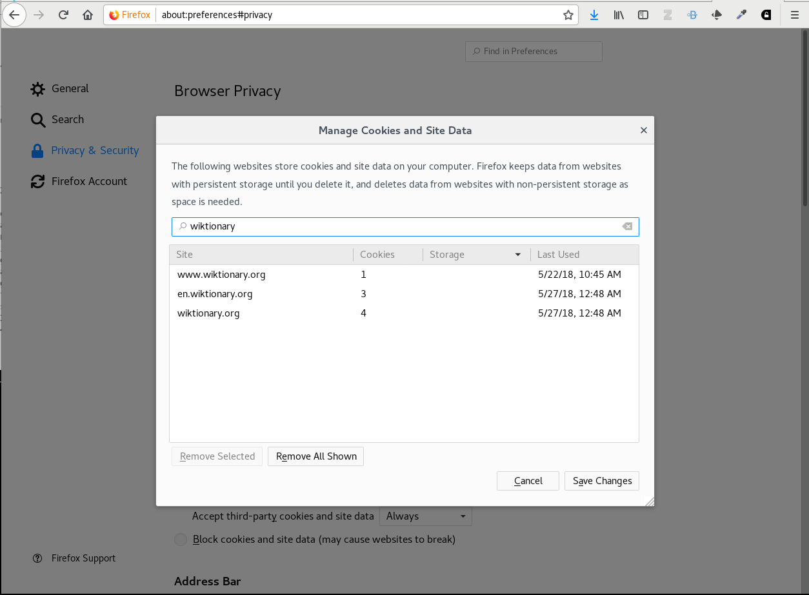
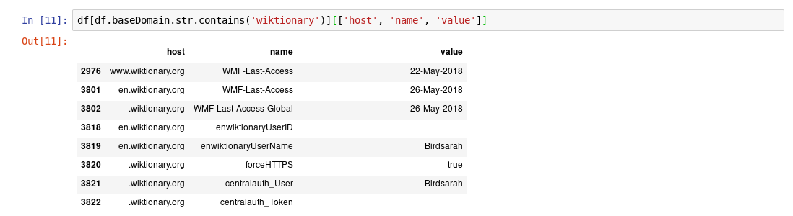
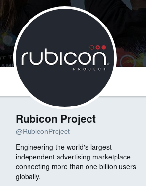
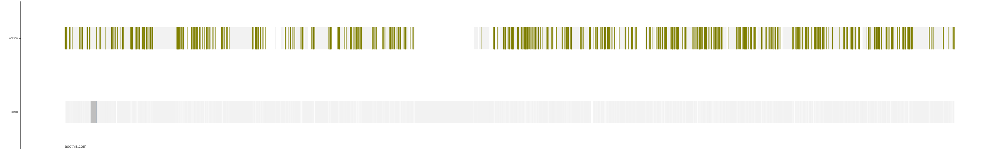
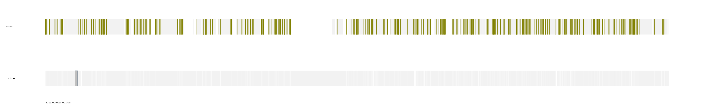
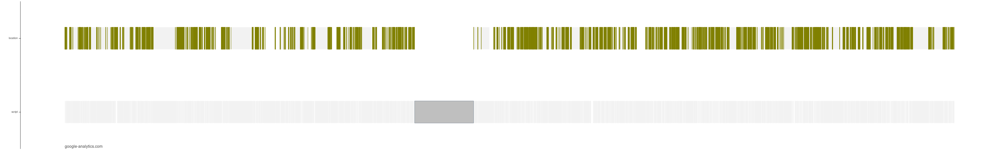
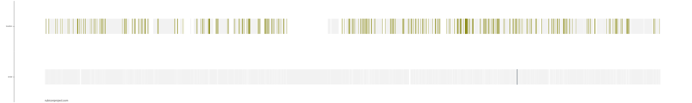
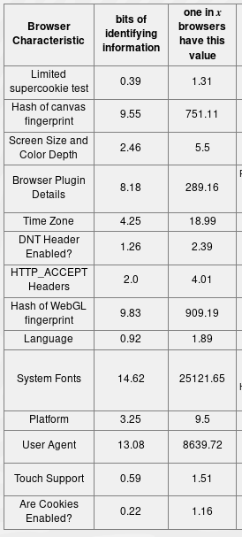

# <b>The web is terrifying!</b>

### Sarah Bird

<br />
<h3 style="display: inline-block; padding: 0.3rem 1.5rem 0.5rem; color: white; font-weight: bold; background-color: black"> moz://a</h3>
<br />
<div>
</img>
<h4 style="margin-top: -2rem">bokeh.pydata.org</h4>
</div>

---

## Committed to 

an internet that

- includes all the peoples of the earth
- promotes civil discourse and individual expression
- elevates critical thinking and shared knowledge
- catalyzes working together for the common good

[Mozilla Manifesto & 2018 Addendum](https://www.mozilla.org/en-US/about/manifesto/)

---

# Tracking technologies

---

### Cookies 

> An HTTP cookie is a small piece of data that a
server sends to the user's web browser. The browser may store it and send it back with the next request to the same server.  <cite>[developer.mozilla.org/en-US/docs/Web/HTTP/Cookies](https://developer.mozilla.org/en-US/docs/Web/HTTP/Cookies)</cite>

---

> tmpPersistentuserId

> 43038346ae23c38666a69e44f980f244

> haaretz.com

---

</img>

---

</img>

---

<a href="http://localhost:8888/notebooks/A%20look%20at%20my%20cookies......ipynb" target="_blank">Let's take a look</a>

---

## rubiconproject.com - 88 cookies

---

</img>

---

## define rubicon

> *noun* A point of no return.

> *example* Once you've crossed the Rubicon there's no going back.

---

3 months

\> 5700 cookies

##### <ion-icon name="logo-github"></ion-icon>  [disconnectme/disconnect-tracking-protection](https://github.com/disconnectme/disconnect-tracking-protection/blob/master/services.json)

---

<figcaption>Categorization from disconnect.me</figcaption>

|category | count
|--------|------   
|Advertising    | 914
|Content     |292
|Analytics   |112
|Social  |55
|Disconnect  |38
|Uncategorized\* |    4303


<small>\* Not identified by disconnect as belonging to a particular tracking
category. <br/>We'll come back to this later</small>
---

But you can delete your cookies.

---

## Zombie cookie & Cookie sync

---

### Cookie Syncing

> "the process by which two different trackers link the IDs they’ve given to the
same user"  <cite>[freedom-to-tinker.com/2014/08/07/the-hidden-perils-of-cookie-syncing/](https://freedom-to-tinker.com/2014/08/07/the-hidden-perils-of-cookie-syncing/)</cite>

<blockquote>"This guide explains how the Cookie Matching Service enables you to make more effective bidding choices." <cite>[developers.google.com/ad-exchange/rtb/cookie-guide](https://developers.google.com/ad-exchange/rtb/cookie-guide)</cite></blockquote>

---

<a href="http://localhost:8888/notebooks/A%20look%20at%20my%20cookies......syncing.ipynb" target="_blank">Any evidence of syncing?</a>

---

Interlude - my learning journey:

* Python, JS, stuff - I learned as a software engineer
* Pandas - https://github.com/brandon-rhodes/pycon-pandas-tutorial
* Bokeh


Ingredients: 
* Publications
* People
* Projects

---

### Zombie cookie

> a cookie that is recreated after deletion

> by storing the cookie data in several types of storage
  mechanisms that are available on the browser.
   <cite>[samy.pl/evercookie/](https://samy.pl/evercookie/)</cite>

---


Any evidency of zombies?

<a href="http://localhost:8888/notebooks/A%20look%20at%20my%20local%20storage......ipynb#" target="_blank">Part 1</a>
<a href="http://localhost:8888/notebooks/A%20look%20at%20my%20cookies.....evercookie%20test.html" target="_blank">Part 2</a>

---

> "A cookie is a small file placed onto your device that enables LinkedIn
features and functionality." <cite>LinkedIn</cite>

> *and enables companies to compile your browsing history and online behavior*

---

Do you care who knows your browsing history?

What about browsing history + location + smartfridge + drone feeds?

What about if that data is is stolen?

What if you paid 20% more for a service than your friend?

---

> Your browsing history can be, and is, connected to your real-world identity

---

### twitter, reddit, github, instagram, linkedin, ...

---

</img>

---

cookies -> browsing history

Okay, I'll disable cookies.....

---

browsing history -> identity

---

The language we love to hate

# JavaScript

---

## Systems Research Group

---

# OverScripted!

---

### 1 million locations visited

### 131m javascript calls recorded

---

## Systems Research Group

## + 

## UCOSP students

[https://hacks.mozilla.org/2018/06/overscripted-digging-into-javascript-execution-at-scale](https://hacks.mozilla.org/2018/06/overscripted-digging-into-javascript-execution-at-scale)

---

This is where I came into the data

---

Downloading, processing, cleaning the data 

---

> ### dask <cite>[dask.pydata.org](https://dask.pydata.org)</cite>

> ### pyspark <cite>[spark.apache.org](https://spark.apache.org/docs/latest/api/python/pyspark.html)</cite>

---

```
filesRDD = sc.wholeTextFiles(BUCKET_NAME, minPartitions=3000)
```

---

```python
>>> import dask.dataframe as dd
>>> ddf = dd.read_parquet('../cache_new.parquet/')
>>> ddf.dtypes

arguments          object
call_id            object
call_stack         object
crawl_id            int64
func_name          object
in_iframe            bool
location           object
operation          object
script_col         object
script_line        object
script_loc_eval    object
script_url         object
symbol             object
time_stamp         object
value              object
dtype: object
```

---

### First aha moment






---

### Tracking Technologies

#### Canvas fingerprinting

---

<a href="http://localhost:8888/notebooks/overscripted-canvas-fingerprinting.ipynb" target="_blank">Canvas fingerprinting</a>

---

Fingerprinting

[panopticlick.eff.org](https://panopticlick.eff.org)

---

</img>

---

<figcaption>Categorization from disconnect.me</figcaption>

|category | count
|--------|------   
|Advertising    | 919
|Content     |263
|Analytics   |105
|Social  |51
|Disconnect  |37
|Uncategorized | 4114

---

### Fingerprinting the fingerprinters

A work in progress to see if we can use machine learning to automate the
detection of tracking technlogies.

---

</img>

---

# Any hope?

---
<table class="call-to-action">
    <tr class="call">
        <td><ion-icon name="construct"></ion-icon></td><td>Technology</td>
    </tr>
    <tr class="call">
        <td><ion-icon name="paper"></ion-icon></td><td>Policy</td>
    </tr>
    <tr class="call">
        <td><ion-icon name="people"></ion-icon></td><td>Community</td>
    </tr>
</table>

---

### <ion-icon name="construct"></ion-icon> Technology


* Firefox
* Private search
* Privacy add ons
* VPN
* Tor (network and browser)

---

### <ion-icon name="paper"></ion-icon> Policy

---

## GDPR
#### European Union's General Data Protection Regulation

---

### <ion-icon name="people"></ion-icon> Community

* educate yourself and others
* activism
 * get involved in local efforts
 * stand up for your rights
 * complain on twitter

---

## get digging

### [github.com/mozilla/Overscripted-Data-Analysis-Challenge](https://github.com/mozilla/Overscripted-Data-Analysis-Challenge)

---

# Prizes

top 3 analyses

present at [MozFest 2018](https://mozillafestival.org/) in London

<small>
(airfare, hotel, admission and, if necessary, visa fees covered)
</small>

---

# <b>Thanks!</b>

@birdsarah

[github.com/mozilla/Overscripted-Data-Analysis-Challenge](https://github.com/mozilla/Overscripted-Data-Analysis-Challenge)
